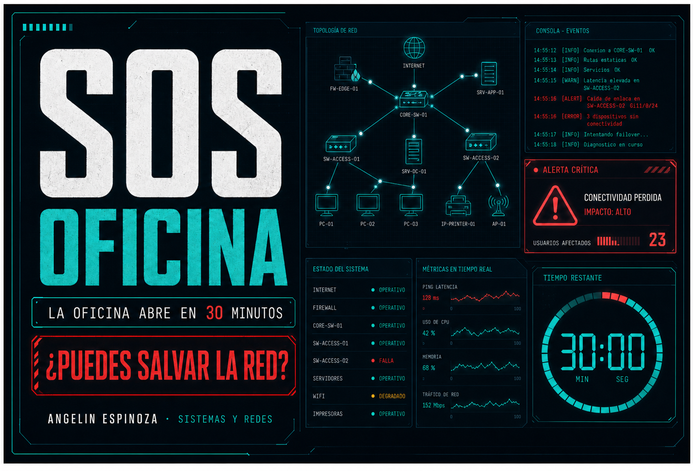

<h1 align="center">SOS Oficina</h1>

<p align="center">
  
</p>

<p align="center">
  
  
  
  
  
</p>

<p align="center">
  <a href="https://angeline-jose-molina-espinoza.github.io/sos-oficina/">
    
  </a>
  <a href="#arquitectura">
    
  </a>
  <a href="documentation/TESTING.md">
    
  </a>
  <a href="source/app/question-bank.ts">
    
  </a>
</p>

SOS Oficina es una simulación de respuesta a incidencias creada por **Angelin Espinoza** para demostrar criterio técnico en Sistemas Microinformáticos y Redes. La experiencia sitúa al usuario ante una guardia de soporte con fallos de conectividad, sistemas, hardware y seguridad que deben resolverse mediante evidencias, priorización y decisiones seguras.

No es un cuestionario de memoria. Cada caso presenta un aviso, contexto operativo, salida de terminal, posibles actuaciones y una explicación técnica. La puntuación valora la precisión y penaliza las decisiones que aumentan el riesgo.

## Vista general

<p align="center">
  <a href="https://angeline-jose-molina-espinoza.github.io/sos-oficina/">
    
  </a>
</p>

<p align="center">
  <sub>Simulación pública y responsive: 500 casos disponibles, 50 incidencias aleatorias y 30 minutos por guardia.</sub>
</p>

## Capacidades demostradas

- diagnóstico estructurado desde el síntoma hasta la causa probable;
- interpretación de `ipconfig`, `ping`, `nslookup`, registros y estados de servicio;
- resolución de problemas DHCP, APIPA, DNS, puerta de enlace, Wi-Fi y conectividad;
- soporte Windows y Linux, hardware, almacenamiento y virtualización;
- identificación de phishing, malware, permisos inseguros y malas prácticas;
- priorización por impacto, urgencia y riesgo;
- comunicación técnica comprensible para personas no especialistas;
- diseño responsive, accesibilidad básica y publicación web estática.

## NEXA, asistente técnico contextual

NEXA acompaña la simulación sin resolver automáticamente las incidencias. Su base de conocimiento incluye conceptos y procedimientos de SMR:

- IP, IPv4, máscara de subred, puerta de enlace, DHCP, DNS y APIPA;
- configuración de IP en Windows y Linux;
- creación y comprobación de ámbitos DHCP;
- diagnóstico ordenado de Wi-Fi y acceso a Internet;
- errores comunes, causas probables y acciones de verificación;
- Windows, Linux, redes, seguridad, copias, permisos y virtualización;
- explicación del proyecto, sus objetivos y su forma de uso.

Las preguntas se procesan en el navegador. El test de red realiza una comprobación orientativa contra la propia página y muestra latencia aproximada y, cuando el navegador la facilita, velocidad estimada.

## Flujo de una guardia

```text
Aviso del usuario
       |
       v
Revisión de evidencias
       |
       v
Hipótesis técnica
       |
       v
Acción mínima y segura
       |
       v
Verificación y explicación
       |
       v
Siguiente incidencia
```

## Arquitectura

```text
sos-oficina/
|-- assets/                     # recursos compilados para GitHub Pages
|-- documentation/
|   |-- ARCHITECTURE.md         # decisiones y componentes del sistema
|   `-- TESTING.md              # estrategia y casos de comprobación
|-- source/
|   |-- app/
|   |   |-- globals.css         # interfaz responsive y animaciones
|   |   |-- layout.tsx          # metadatos y estructura base
|   |   |-- page.tsx            # simulador, NEXA y lógica de interacción
|   |   `-- question-bank.ts    # generación del banco de 500 casos
|   |-- package.json
|   `-- vite.pages.config.ts
|-- .nojekyll
|-- ai-network-bg.jpg
|-- favicon.svg
|-- index.html                  # entrada pública
|-- og.png                      # vista previa social
`-- README.md
```

La aplicación utiliza componentes React y estado local para mantener la partida, el tiempo, la puntuación y el contexto de NEXA. TypeScript define los contratos de cada incidencia. La versión pública se compila como sitio estático y se sirve mediante GitHub Pages.

Más detalles en [documentation/ARCHITECTURE.md](documentation/ARCHITECTURE.md).

## Decisiones técnicas

- **Selección aleatoria:** cada guardia obtiene 50 casos de un banco de 500.
- **Contenido tipado:** las incidencias comparten un contrato común para evitar estados incompletos.
- **Diagnóstico explicable:** cada opción incluye retroalimentación y una secuencia recomendada.
- **Privacidad por diseño:** NEXA no transmite las preguntas a servicios externos.
- **Sin backend obligatorio:** la simulación puede ejecutarse desde un alojamiento estático.
- **Responsive:** la interfaz reorganiza paneles, terminal y asistente para escritorio y móvil.
- **Movimiento con propósito:** partículas, pulsos, paquetes de red y ticker refuerzan el estado operativo sin bloquear la lectura.

## Ejecutar el proyecto

Requisitos: Node.js 22 o superior.

```bash
npm install
npm run dev
```

Compilación de comprobación:

```bash
npm run build
```

Generación de la versión para GitHub Pages:

```bash
npm run pages:build
```

## Comprobaciones principales

- inicio de una guardia con 50 incidencias;
- selección aleatoria desde el banco de 500 casos;
- puntuación, penalizaciones, avance y finalización;
- temporizador de 30 minutos;
- respuestas contextuales de NEXA;
- reconocimiento de distintas formas de formular una pregunta;
- test de conexión orientativo;
- navegación por teclado y controles táctiles;
- adaptación de escritorio a móvil;
- carga de recursos desde la ruta pública de GitHub Pages.

La estrategia completa está documentada en [documentation/TESTING.md](documentation/TESTING.md).

## Autora

**Angelin Espinoza**  
Técnica en Sistemas Microinformáticos y Redes  
Soporte IT · Sistemas · Redes · Seguridad

Este proyecto forma parte de un portfolio técnico centrado en convertir conocimientos de SMR en demostraciones prácticas, verificables y fáciles de explorar.

---

<p align="center">
  
</p>
